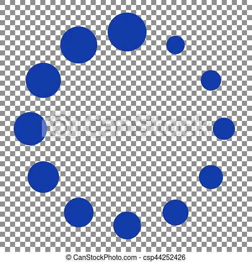
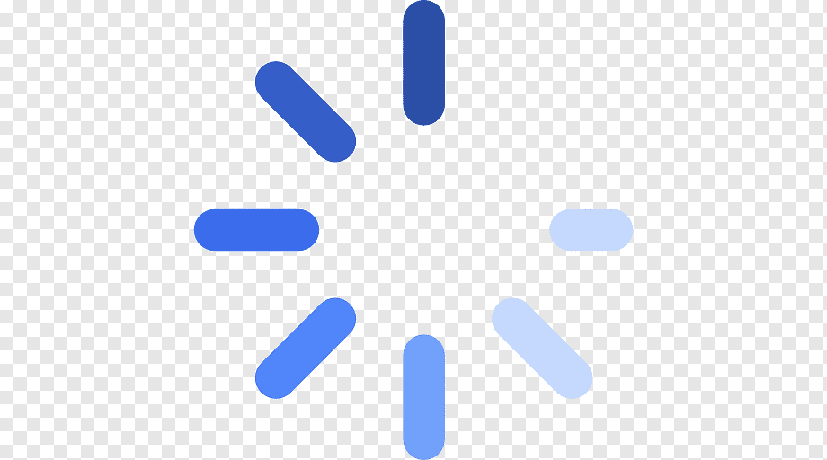

<h1 align="center">
    Api_NodeJS
</h1>

    
    

    Uma API em node.js para ligação e cadastro com o banco de dados de usuários em um sistema de login e senha simples.

<h2>
    Etapas
</h2>

    Criar projeto node 

    Arquitetura de pastas do projeto 

    Data base 

    Autenticação de usuário 

    Recuperação de senha 

    Ligação com o banco de dados 

